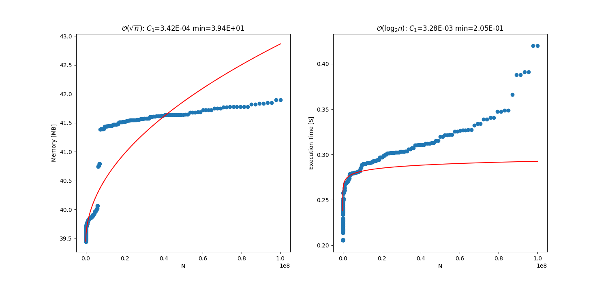

Python scripy for getting the time and space complexity of algorithyms.

bench.py does a benchmark of the function preformance using memory profiler's 'mprof.py' as a dependency (See documentation here https://pypi.org/project/memory-profiler/) 

analyze.py does a fit of the resulting data and estimates coefficients and intercepts. 

run.sh executes both of the above files sequentially and compiles the data results into a .7z file for futher analysis. 

Some examples of the script are below:

